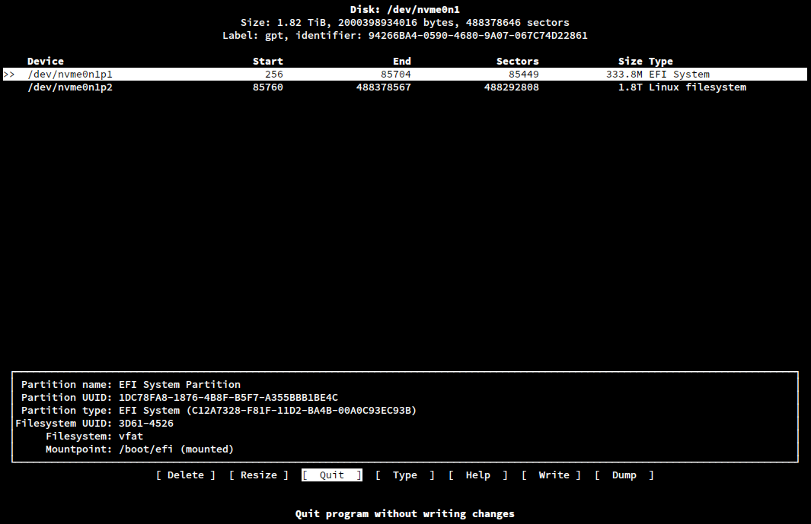

> [!IMPORTANT]
> Denne guiden dokumenterer hvordan **jeg** setter opp **min** Arch-installasjon.
>
> Den er ikke ment som en universell «beste praksis», og ikke er den nødvendigvis anbefalt av meg heller, men mer som en levende dokumentasjon av mine egne valg, preferanser og erfaringer. Dersom du velger å følge den, gjør du det på eget ansvar. Eller ikke, jeg er ikke faren din.
>
> Ha gjerne den [offisielle installasjonsguiden til Arch Linux](https://wiki.archlinux.org/title/Installation_guide) åpen ved siden av. Arch Wiki vet sannsynligvis bedre enn meg. Dette er tross alt YikesOS.

# Innholdsfortegnelse

- [Introduksjon](#introduksjon)
- [Hvorfor Arch?](#hvorfor-arch)
- [Inne i live-miljøet](#inne-i-live-miljøet)
  - [Tastaturoppsett](#tastaturoppsett)
  - [UEFI](#uefi)
  - [Internett](#internett)
  - [Klokke og NTP](#klokke-og-ntp)
- [Partisjonering av disker](#partisjonering-av-disker)
  - [Min disklayout](#min-disklayout)
  - [Formatering](#formatering)
  - [Hvorfor EXT4?](#hvorfor-ext4)
  - [Hvor er swap-partisjonen?](#hvor-er-swap-partisjonen)
- [Montering av filsystemene](#montering-av-filsystemene)
- [Valg av mirrors](#valg-av-mirrors)
- [Installasjon av basesystemet](#installasjon-av-basesystemet)
  - [Filosofien bak `pacstrap`](#filosofien-bak-pacstrap)
  - [Lag 1 – Basesystemet](#lag-1--basesystemet)
  - [Lag 2 – Første oppstart](#lag-2--første-oppstart)
  - [Lag 3 – Skrivebordet](#lag-3--skrivebordet)
  - [Lag 4 – Gaming](#lag-4--gaming)

---

# Introduksjon

Først og fremst er det viktig å nevne at dette **ikke** er en guide jeg nødvendigvis anbefaler andre å følge.

YikesOS er slik **jeg** ønsker å sette opp **mitt** system. Alle programmene og valgene som er gjort her er basert på mine egne behov, preferanser og arbeidsflyt.

>[!DISCLAIMER]
>Ja jeg vet at "YikesOS" ikke er i nærheten av å kunne kalles et eget OS.

Grunnen til at jeg har tatt de valgene jeg har tatt vil forklares underveis. Typiske begrunnelser vil være:

- Jeg trenger dette spesifikt.
- Jeg vet det finnes bedre alternativer, men jeg liker denne løsningen best. ([Jeremy Clarkson – "But I like this"](https://www.youtube.com/watch?v=k0f3A8whsxM)).
- Det ser kult ut.

Det er også verdt å nevne at denne installasjonen kun dekker det jeg anser som **basisprogrammer**. Med det mener jeg programmer som er nødvendige for at maskinen skal være komplett for meg – eksempelvis Steam, en editor og en terminal.

Programmer som jeg syns er «kjekt å ha», som for eksempel Amethyst Mod Manager, blir ikke inkludert.

Jeg tester også stadig nye programmer som gjør samme jobb som programmer jeg allerede bruker. Derfor vil denne guiden alltid reflektere de **stabile** programmene jeg faktisk ender opp med å bruke. Eksperimenter får ikke plass her før de har blitt "mainline".

> [!NOTE]
> «Stabil» i denne sammenheng betyr ikke nødvendigvis konservativt, kjedelig eller stabilt, for den saks skyld. Det betyr bare at jeg faktisk bruker programmet, og ikke installerte det for tre dager siden fordi noen på Reddit sa det var kult.

---

# Installasjonen begynner

Jeg tar utgangspunkt i at jeg ikke trenger å fortelle deg hvordan du laster ned en ISO-fil, brenner den til en minnepenn og setter minnepennen som boot-enhet.

Om du trenger hjelp med dette, se [USB flash installation medium](https://wiki.archlinux.org/title/USB_flash_installation_medium) på Arch Wiki. Eller vurder å ikke installere Arch manuelt i det hele tatt.

> [!TIPS] 
> Det kan også være en god ide å lese over hvert avsnitt i sin helhet før man setter i gang med det.

> [!TIPS 2]
> Hver gang jeg bruker nvim kan du så klart bruke din foretrukne terminalbaserte teksteditor, eksempelvis nano. Hvis du er *en sånn en*.

---

# Hvorfor Arch?

Så, hvorfor Arch?

Arch er valgt fordi det er lightweight – les: uten mer bloat enn jeg selv velger å installere – og så godt som fullstendig brukerkonfigurerbart.

Jeg har også vært fristet av Gentoo, men jeg ønsker faktisk ikke å kompilere **ALT** selv. Jeg vet man ikke trenger det lenger, og at Gentoo tilbyr binærpakker for mye programvare, men jeg foretrekker enkelheten i Arch.
Samtidig liker jeg tidvis å kompilere programmer selv.

Selvmotsigende, eller hva?

Igjen: mitt OS.

Jeg er også stor fan av `pacman`, AUR og selvfølgelig rolling release.

---

# Installasjonen begynner

## Tastaturoppsett

Last inn norsk tastaturoppsett:

```bash
loadkeys no
```

Dette er tastaturoppsettet jeg er vant med. Bruk naturligvis noe annet dersom du foretrekker det.

## UEFI

Arch Wiki anbefaler nå å bekrefte at installasjonsmediet faktisk er startet i UEFI-modus.

Jeg tar videre utgangspunkt i at maskinen bruker UEFI og ikke klassisk BIOS. Bruker du mot formodning et hovedkort fra 2012 eller tidligere, kan du finne en annen guide.

> [!NOTE]
>Dette gjør du hvis ditt hovedkort har BIOS; kjøp nytt. Du kan antageligvis *finne* et hovedkort med UEFI gratis på Finn

---
## Internett

Sjekk først om maskinen allerede har nett:

```bash
ping nrk.no
```

Du kan pinge hva du vil, for eksempel `archlinux.org` eller `google.com`. Poenget er bare:

> Har du nett?

Dersom du bruker Ethernet, fungerer det som oftest automatisk i live-miljøet.

Dersom du må koble til trådløst, bruker du `iwctl`. Se [iwd – Connect to a network](https://wiki.archlinux.org/title/Iwd#Connect_to_a_network) for full dokumentasjon. Nei, jeg gidder ikke skrive guide for alle mulige edge-cases.

### IWCTL

*Jeg vet jeg nettopp skrev at jeg ikke gadd å lage guide i tilfelle man må bruke iwctl, men så måtte jeg gjøre det på en laptop jeg installerte Arch på, så fuck it, jeg legger det med.*

For å koble til med iwctl:

```bash
iwctl
```

Inne i `iwctl`:

```text
device list
station wlan0 scan
station wlan0 get-networks
station wlan0 connect "SSID"
```

Bytt ut `wlan0` med navnet på ditt trådløse grensesnitt, og `SSID` med navnet på nettverket.

---
## Klokke og NTP

Sjekk status på systemklokka:

```bash
timedatectl
```

Dersom NTP ikke er aktivert:

```bash
timedatectl set-ntp true
```

Kontroller deretter status på nytt:

```bash
timedatectl
```

Om det da enda ikke er riktig så veit ikke jeg hva du skal gjøre ass. Prøv google?

---

# Partisjonering av disker

Jeg tar – tydeligvis – mange utgangspunkt.

Her tar jeg utgangspunkt i at du har en grunnleggende forståelse av disker, partisjoner, filsystemer og mount points. Dersom ikke, les [Partitioning](https://wiki.archlinux.org/title/Partitioning) og [File systems](https://wiki.archlinux.org/title/File_systems) først. Jeg mener det. Det er lurt å legge en slagplan for dette umiddelbart, for det å endre/fikse slikt i ettertid ville jeg ikke unnet min verste fiende en gang.

Veldig kort oppsummert og enkelt forklart så fungerer det slik:

```text
Fysisk disk
    └── Partisjon
          └── Filsystem
                └── Montert et sted i filtreet
```

Finn først ut hva diskene heter:

```bash
fdisk -l
```

Mine heter eksempelvis:

```text
/dev/nvme0n1
/dev/nvme1n1
```

Jeg anbefaler `cfdisk`, som er et TUI-grensesnitt for partisjonering. Altså et litt mer grafisk terminalprogram enn vanlig `fdisk`. Det er intuitivt, oversiktlig og forteller deg stort sett hva knappene gjør nederst på skjermen.



Åpne første disk:

```bash
cfdisk /dev/nvme0n1
```

Velg `GPT` dersom disken er tom og du blir spurt om partisjonstabell.

## Min disklayout

Jeg bruker to NVMe-disker:

```text
nvme0n1
├── nvme0n1p1   1 GiB       EFI System Partition
│                              └── monteres på /boot
│
└── nvme0n1p2   resten      Linux root-filsystem
                               ├── /
                               └── /home ligger som en vanlig mappe her

nvme1n1
└── nvme1n1p1   hele disken til ekstra lagring
                               └── monteres på /home/sykes/storage
```

`/boot` får en hel gigabyte med lagring, fordi jeg er så grei.

`/boot` får en hel gigabyte med lagring, fordi jeg er så grei.

<details>
<summary>Hvorfor 1 GB?</summary>
1GB er langt mer enn det som er nødvendig, men diskplass er billig. Limine, kernelen og initramfs tar kanskje et par hundre MB med plass - men, hvis man plutselig har 3 kernels, og eksperimenterer med en ny bootloader så er det fint med den ekstra plassen, også koster det meg ingenting. Du kan gjerne bruke f.eks 512MB her istedenfor, hvis du vil.
</details>

Resten av den første disken går til `/`. `/` er altså selve root-filsystemet. `/home` ligger som en vanlig mappe inne på dette filsystemet og har ikke en egen partisjon. Dette fordi det ikke trengs lenger, og har egentlig ingen fordeler. Med mindre man reinstaller ofte, og gjerne vil beholde alt man har i /home.

<details>
<summary>Mer om hvorfor jeg ikke bruker separat /home</summary>
Jeg reinstallerer ofte, men jeg har ingen behov for å beholde noe når jeg gjør det. Jeg har 10Gb internett, og liker den *freshe* følelsen av en helt clean install. Hvis du ønsker å separere ut /home i en egen partisjon for enkel re-installasjon, go right ahead.
</details>

Den andre NVMe-disken brukes som ekstra lagringsplass, og vil ikke bli montert enda. Den vil vi montere når vi har chroot'et inn i systemet senere.

> [!WARNING]
> Dobbeltsjekk hvilken disk og partisjon du arbeider på før du formaterer. Kjedelig å finne ut at du har formatert EFI-partisjonen til EXT4 når du rebooter.

## Formatering

EFI-partisjonen formateres som FAT32:

```bash
mkfs.fat -F 32 /dev/nvme0n1p1
```

Husk også å markere partisjonen som `EFI System` i `cfdisk`.

Root-partisjonen formateres som EXT4:

```bash
mkfs.ext4 /dev/nvme0n1p2
```

Den andre NVMe-disken formateres også som EXT4:

```bash
mkfs.ext4 /dev/nvme1n1p1
```

> [!CAUTION]
> Kommandoene over sletter ALL eksisterende data på partisjonene. Og, bruk navnene som faktisk gjelder på din maskin – ikke mine.

---
## Filsystem

> [!NOTE]
>  «WHAT?! EXT4?!»** hører jeg deg skrike.
>
> Ja. EXT4.
>
> «MEN BTRFS ER SÅ MYE BEDRE!»
>
> Er det det, altså?

Copy-on-Write er kult, og muligheten for snapshots er megapraktisk. Men *jeg* har aldri tatt meg bryet med å lære hvordan jeg manuelt setter opp Btrfs, subvolumes og snapshots skikkelig.

Og jeg brenner heller i helvete enn å la *noen andre* fikse det for meg.

Så inntil jeg gidder å lære meg Btrfs, subvolumes og hvordan snapshots faktisk skal settes opp, blir det EXT4.

EXT4 er modent, enkelt og passer arbeidsflyten min. Ytelsen er god, oppførselen er forutsigbar, og det krever ingen ekstra struktur jeg ikke bruker.

Jeg har dessuten aldri hatt et faktisk behov for snapshots. Det kan hende jeg er privilegert, men sånn er det.

Dersom *du* vil bruke et annet filsystem: go ahead. Btrfs fungerer også uten at du tar i bruk alle funksjonene med én gang:

```bash
mkfs.btrfs /dev/nvme0n1p2
```

Men da er resten av denne guiden ikke nødvendigvis riktig for oppsettet ditt. Se [Btrfs](https://wiki.archlinux.org/title/Btrfs) på Arch Wiki.

> [!NOTE]
> 
> Btrfs er sannsynligvis den teknisk bedre løsningen.
>
> EXT4 er løsningen **jeg faktisk bruker**.
>
> Jeg optimaliserer for det jeg gjør i praksis – ikke for features jeg kanskje bruker en dag.

---
## Swap

«Yikes! Du har glemt en swap-partisjon!»

Nei. Det har jeg ikke.

Jeg bruker ikke hibernation. Suspend fungerer fint til mitt bruk, og i stedet for en tradisjonell swap-partisjon eller swapfil kommer denne installasjonen senere til å bruke **swap on zram**.
Se [zram](https://wiki.archlinux.org/title/Zram) på Arch Wiki. (Det kommer også mer om det senere i guiden)

> [!IMPORTANT]
> Dersom du ønsker hibernation, må du planlegge swap og resume-oppsett for dette. Det er ikke dekket av denne guiden. Se [Suspend and hibernate](https://wiki.archlinux.org/title/Power_management/Suspend_and_hibernate).

---

# Montering av filsystemene

Vi må naturligvis starte med root-partisjonen:

```bash
mount /dev/nvme0n1p2 /mnt
```

`/mnt` er mount pointet hvor vi bygger det framtidige root-filsystemet mens vi fortsatt befinner oss i live-miljøet.

Etter montering er `/mnt` i praksis den framtidige `/`.

Deretter monterer vi EFI-partisjonen på `/mnt/boot`:

```bash
mount --mkdir /dev/nvme0n1p1 /mnt/boot
```

`--mkdir` oppretter `/mnt/boot` dersom mappen ikke allerede finnes.

Det ferdige treet ser da omtrent slik ut:

```text
/mnt                    ← framtidig /
├── boot                ← nvme0n1p1, FAT32
└── resten              ← nvme0n1p2, EXT4
```

Bekreft at alt er montert riktig:

```bash
lsblk -f
```

Visualisert ser dette omtrent slik ut:

```text
Live-ISO
    │
    ▼
 /mnt
 ├── /boot
 └── /home
    │
    ▼
Den ferdige installasjonen
```

> [!NOTE]
> Root-partisjonen monteres først fordi den er selve grunnlaget for filtreet. `/boot` er bare et sted *inne i dette treet* hvor andre filsystemer kobles på.
>
> Ikke `/root`. Bare `/`.
>
> Jeg nevner det fordi det tok meg flaut lang tid å skjønne hvordan det greiene her fungerer. Nei, jeg tar ikke imot noen kommentarer på det.

---

# Valg av mirrors

Før vi installerer basesystemet velger vi mirrors som pakkene skal lastes ned fra.

Vi **må** ikke gjøre dette, men vi skal. Optimalisering.

Jeg gidder ikke teste alle mirror-serverne selv og bruker derfor [Reflector](https://wiki.archlinux.org/title/Reflector):

```bash
reflector --latest 5 --protocol https --age 12 --sort rate --save /etc/pacman.d/mirrorlist
```

Dette finner fem nylig synkroniserte HTTPS-mirrors, sorterer dem etter hastighet og skriver resultatet til:

```text
/etc/pacman.d/mirrorlist
```

Mirrorlisten blir kopiert inn i den nye installasjonen av `pacstrap`, altså blir den med på den endelige installasjon. Det er derfor praktisk å gjøre dette nå.

Du kan naturligvis endre antallet. Det må ikke være fem.

> [!TIP]
> Dersom Reflector gir deg en merkelig eller treg mirrorliste, eksempelvis bare afrikanske mirrors, ikke vær redd for å kjøre kommandoen på nytt med andre kriterier. Sjekk mirrorlisten med `cat /etc/pacman.d/mirrorlist`


---

# Basisinstallasjon

## Filosofien bak min `pacstrap`

> [!IMPORTANT]
> `pacstrap` brukes i denne guiden ikke for å installere det komplette systemet, med alle pakkene det til slutt vil ha. Dette er med vilje. Resten av de nødvendige programmene for den ferdige installasjon vil komme senere, først er målet er å installere et system som kan:
>
> - Boote.
> - Koble seg til internett.
> - Redigere konfigurasjonsfiler.
> - Installere resten av systemet fra sitt eget miljø.
>
> Alt annet kommer **etter første reboot**.

Jeg deler derfor installasjonen inn i flere lag. Det gjør installasjonen enklere å forstå, enklere å feilsøke og tydeligere å dokumentere.

```text
Basesystem
    ↓
Første oppstart
    ↓
Skrivebord
    ↓
Gaming og daglig bruk
```

---
## Pakkene

Dette er pakkene jeg installerer med `pacstrap`.

| Pakke            | Hvorfor                                                                                                                                            |
| ---------------- | -------------------------------------------------------------------------------------------------------------------------------------------------- |
| `base`           | Selve grunnsystemet. Inneholder blant annet `bash`, `coreutils` og `pacman`.                                                                       |
| `base-devel`     | Verktøy for å bygge pakker. Strengt tatt ikke nødvendig for å boote, men nødvendig for AUR senere, og jeg kommer til å trenge det.                 |
| `linux-lts`      | Stabil kernel som utgangspunkt og framtidig reservekernel. CachyOS-kernel kommer senere.                                                           |
| `linux-firmware` | Firmware til mye av maskinvaren. Du vet, så ting faktisk fungerer.                                                                                 |
| `amd-ucode`      | Mikrokodeoppdateringer til AMD-prosessoren. Bruk `intel-ucode` dersom du har Intel.                                                                |
| `networkmanager` | Nettverk etter første oppstart. Ganske hendig.                                                                                                     |
| `sudo`           | Lar den vanlige brukeren utføre administrative kommandoer uten å leve som `root`.                                                                  |
| `git`            | Trengs til GitHub, dotfiles og AUR.                                                                                                                |
| `neovim`         | Teksteditor. Helt essensielt. Nano dersom du er lame.                                                                                              |
| `limine`         | Bootloader. Hvorfor akkurat Limine? Fordi jeg liker utseendet. Den er også lett, rask og kan redde deg hvis du skriver feil i boot.conf filen din. |
| `efibootmgr`     | Brukes til å administrere UEFI-bootoppføringer.                                                                                                    |

> [!NOTE]
>Ja, `base-devel`, `git` og `neovim` er mer enn det absolutt minimale systemet trenger for å boote.
>
> Men dette er ikke *bare* en konkurranse i å ha færrest mulig pakker. Det er en installasjon som skal være praktisk å fullføre etter første reboot.

Installer basesystemet:

```bash
pacstrap -K /mnt base base-devel linux-lts linux-firmware amd-ucode networkmanager sudo git neovim limine efibootmgr
```


Har du Intel-prosessor, erstatter du amd-ucode med intel-ucode.

---

> [!WARNING]
> Ikke installer både `amd-ucode` og `intel-ucode` bare fordi du er usikker. Hvis du ikke vet hvilken prosessor du har, hvorfor i alle dager manuelt installerer du Arch?

Nå som vi har fått lastet ned basispakkene for et fungerende system, må vi inn i installasjonen vi nettopp har lagd. 

Vi starter med å generere filsystemet. Dette gjør vi med [genfstab.](https://wiki.archlinux.org/title/Genfstab) 

```bash
genfstab -U /mnt >> /mnt/etc/fstab
```

Så må vi inn i vår ferske installasjon, dette gjør vi med;

```bash
arch-chroot -S /mnt
```

---
## De første konfigurasjonene

### Tidssone

Velkommen inn i det ferske systemet! Vi starter med et par kjappe, lette konfigurasjoner som er hendige, for eksempel å få riktig klokkeslett.

```bash
ln -sf /usr/share/zoneinfo/Europe/Oslo /etc/localtime`
```

Klart, om du ikke holder til i Oslo, så kan du jo vurdere å velge en tidssone som er mer riktig for deg. Liste over tidssoner tilgengelig finner du slik;

```bash
ls /usr/share/zoneinfo/Region
```

Så sørger vi før at hardware klokken ikke faller ut av tellinga over tid, det vi gjør med kommandoen; 

```bash
hwclock --systohc
```

---
### Locales

Så må vi generere [locales](https://wiki.archlinux.org/title/Locale).

Locales forteller programmer hvilket språk, tegnsett og regionale innstillinger de skal bruke. Uten dette kan programmer vise feil språk, datoformat eller i verste fall slite med spesialtegn som `æ`, `ø` og `å`.

Klart, du *maa* ikke gjøre dette, men jeg anbefaler det på det sterkeste.

---

Endre på /etc/locale.gen med; 

```bash
nvim /etc/locale.gen
```

alternativt med `

```bash
nano /etc/locale.gen
```

hvis du er ukulturert, og uncomment det/dem du ønsker av locales. Personlig pleier jeg bare å uncommente 

```text
en_US.UTF-8 
```

da det gir meg all funksjonaliteten jeg trenger. Feel free til å uncommente hva enn *DU* vil, dog.

Generer så locales med;

```bash
locale-gen
```

---

Deretter må vi lage en fil for å gjøre det/de valgte locales permanente på installasjonen;

```bash
nvim /etc/locale.conf
```

Inni den filen skal det stå;

```text
LANG=en_US.UTF-8
```

og alternativt andre locales du har uncommented.

Vi gjør også endringen av tastaturspråk permanent nå med;

```bash
nvim /etc/vconsole.conf
```

```text
KEYMAP=no
```

---
### Nettverk o.l

Så skal vi gi datamaskinen et navn.

Dette gjøres ved å opprette et **hostname**. Hostnamet brukes av Linux selv, vises blant annet i terminalen og brukes av ulike nettverkstjenester. På mange lokale nettverk vil dette også være navnet andre enheter ser datamaskinen som.

```bash
nvim /etc/hostname
```

```text
ditthostnavnher
```

Vi legger også inn en `/etc/hosts`-fil.

Denne forteller datamaskinen hvordan den finner sitt eget hostname, uten å måtte spørre en DNS-server. Det er kanskje ikke verdens mest spennende fil, men den kan spare deg for mye hodebry og merkelige forsinkelser senere.

```bash
nvim /etc/hosts
```

```text
127.0.0.1 localhost
::1 localhost
127.0.1.1 ditthostnavnher
```

---
### Initramfs, brukere og bootloader

#### Initramfs

Så må vi regenerere [initramfs](https://wiki.archlinux.org/title/Arch_boot_process#initramfs).

Linux lagde allerede en initramfs automatisk da kjernen ble installert med `pacstrap`. Problemet er at den ble laget **før** vi endret blant annet keymapen.

Vi genererer derfor en ny, slik at alle endringene vi har gjort blir pakket inn i initramfs-en før første oppstart.

```bash
mkinitcpio -P
```

---
##### Passord til root, og bruker-bruker

Så, før vi glemmer det, setter vi et passord for root-brukeren.

```bash
passwd
```

Velg naturligvis hva du vil. 

Vi lager også en bruker, 

```bash
useradd -mG wheel dittbrukernavn
```

etterfulgt av 

```bash
passwd dittbrukernavn
```

Capiche?

---

Vi legger også den nylig lagde brukeren inn i `wheel`-gruppen med en gang, så er det gjort.

For å redigere sudo-konfigurasjonen bruker vi **visudo**.

`visudo` er egentlig bare en trygg måte å redigere `/etc/sudoers` på. Den nekter deg å lagre dersom du har skrevet noe feil, noe som er veldig hendig. Kjedelig å låse seg selv ute fra PC'en i dette stadiet.

[Mer om visudo for de spesielt interesserte her.](https://wiki.archlinux.org/title/Sudo#Using_visudo)

Først:

```bash
EDITOR=nvim visudo
```

Alternativt:

```bash
EDITOR=nano visudo
```

for de lamme.

---

Etterfulgt av 

```bash
visudo /etc/sudoers
```

Her inne uncommenter vi 

```text
%wheel ALL=(ALL:ALL) ALL
```

Der! Da er vi ferdig med det grunnleggende brukeroppsettet.

---
#### Bootloader

Videre så trenger vi en bootloader før vi gjør noe som helst annet.

Vi har jo allerede installert limine via pacstrap, så nå må vi bare bygge konfigurasjonen.

<details>
<summary>Hvorfor Limine? I detalj takk.</summary>
Systemd-boot er bra, EFI-stub boot er kult, GRUB er utrolig modent. Ingen av de gir meg det jeg vil ha. Jeg vil ha en slags kombinasjon av de alle. GRUB er utrolig tungt (til bootloader å være) men veldig konfigurerbar. EFI-stub (altså å boote rett fra UEFI) er kult og utrolig raskt, men gir lite mulighet for fallback til back-up kernel ved problemer, og kan naturligvis ikke konfigureres stort. Systemd-boot er veldig lettveky som program, og støtter flere kernels, men har ingen konfigurering. Limine er lett, kan konfigureres, ser bra nok ut vanilla, og støtter flere kernels. Derfor.
</details>

Vi vil automatisere dette med en AUR-pakke litt senere, slik at nyeste kernel automatisk blir lagt inn i bootloaderen gjennom systemoppdateringer, men for øyeblikket er det viktig å bygge det manult for å forstå hvordan det fungerer, i tilfelle det en dag tilfeldigvis *ikke* fungerer lengre.

Bootloaders kan forøvrig være overraskende interessant lesning, så hvis du er like langt utpå spektrumet som meg så kan jeg anbefale denne Arch-Wiki siden [her.](https://en.wikipedia.org/wiki/Bootloader)

---

```bash
mkdir -p /boot/EFI/arch-limine
```

```bash
cp /usr/share/limine/BOOTX64.EFI boot/EFI/arch-limine`
```

Da har vi lagd /boot/EFI/arch-limine (hvor boot-filen ligger, og der Limine leter etter den. - Ja, Limine kan finne den filen andre steder også, men vi legger den her.)
  
Så må også lage boot-entry. Det bruker vi efibootmgr til;

```bash
efibootmgr \
	--create \
	 --disk /dev/nvme0n1 \
	 --part 1
	 --label "Arch Linux Limine Bootloader" \
	 --loader `\EFI\arch-limine\BOOTX64.EFI` \
	 --unicode
```

Du kan lese videre på [efibootmgr](https://wiki.archlinux.org/title/Efibootmgr) sin side om hvordan endre, legge til, fjerne og sortere kernel-entries hvis du ønsker, men det er egentlig ikke nødvendig da vi straks skal automatisere dette uansett.

---

Nå må vi lage configen til selve Limine. Vi lager en veldig basic en nå, en som fungerer.

Hvis du vil pynte på den senere, feel free. Les i så fall [her](https://wiki.archlinux.org/title/Limine#Configuration) 

>[!WARNING]
> Jeg kommer ikke til å gå over hvordan man pimper tingene sine i denne guiden, men for all del, stjel dotfilene mine.

```bash
nvim limine.conf`
```

```text
timeout: 5
/Arch Linux
	protocol: linux
	 path: boot():/vmlinuz-linux-lts
	 cmdline: root=UUID=_xxxxxxxx-xxxx-xxxx-xxxx-xxxxxxxxxxxx_ rw
	 module_path: boot():/initramfs-linux-lts.img
```

UUID er den unike partisjons-ID'en til /. Denne kan du finne med lsblk.

<details>
<summary>Jeg er litt dum</summary>
Jeg er sånn 99% sikker på at det er en lettere måte å få UUID'en inn på enn å ta bilde av den også skrive den inn manuelt, men det har aldri plagd meg *nok* til at jeg gidder å finne det ut. Det er VELDIG nærme, tho.
</details>

---

Sånn! Nå vet vi hvordan vi manuelt setter opp Limine, slik at vi faktisk kan boote PC'en vår uten live-ISO'et! Godt jobba!

La oss også legge inn en kjapp pacman hook som deployer Limine på nytt hvis det får en oppdatering;

```bash
nvim /etc/pacman.d/hooks/99-limine.hook
```

```text
[Trigger]
Operation = Install
Operation = Upgrade
Type = Package
Target = limine              

[Action]
Description = Deploying Limine after upgrade...
When = PostTransaction
Exec = /usr/bin/cp /usr/share/limine/BOOTX64.EFI  boot/EFI/arch-limine/
```

Strengt tatt ikke nødvendig, but we living on the *bleeding edge*, tross alt.

---

Da er vi faktisk ferdige med basisinstallsjonen! Klapp deg selv på skulderen.

Straks finner vi ut om vi har gjort alt riktig. *På den harde måten*

Skriv `exit` 

Okey, klar? The moment of truth. skriv `reboot`. 

Husk å nappe ut USB'en når PC'en skrur seg på igjen!

---

## Første gang på nytt system!

>[!NOTE]
>HEY! ER DU INNE? NEI?
>Hvis du kjenner meg, send meg DM.
>Hvis ikke, [Google is you friend.](https://giybf.com/)
>Hvis ja, LETS GO!

Etter første reboot installeres systemverktøyene og programmene som gjør maskinen behagelig å bruke, men som ikke er nødvendige for at den skal boote.

Foreløpig liste:

| Pakke            | Formål                                                                                                                                         |
| ---------------- | ---------------------------------------------------------------------------------------------------------------------------------------------- |
| `pipewire`       | Moderne lyd- og mediaserver.                                                                                                                   |
| `pipewire-alsa`  | Gjør at ALSA-programmer spiller gjennom PipeWire. (Nettlesere, f.eks)                                                                          |
| `pipewire-pulse` | PulseAudio-kompatibilitet for programmer som forventer PulseAudio. (Mange spill, f.eks)                                                        |
| `wireplumber`    | Session- og policy-manager for PipeWire.                                                                                                       |
| `zram-generator` | Setter opp swap on zram.                                                                                                                       |
| `zsh`            | Shellet jeg ønsker å bruke. Penere enn bash, mer brukervennlig, oh-my-zsh                                                                      |
| `wezterm`        | Terminalen min. Skrevet i Rust, konfigureres i Lua, støtter bilder og fungerer også på Windows. (Som jeg må bruke i jobb)                      |
| `fastfetch`      | Fullstendig unødvendig. Helt essensielt, hvordan skal du ellers flexe systemet ditt?                                                           |
| `yazi`           | Terminalbasert filutforsker. Jeg foretrekker TUI-ting, men bruk gjerne en GUI-filutforsker om du *må*. Kjenner bare til `dolphin` , i så fall. |

Dette er ikke nødvendigvis den endelige listen, ting kan endres, fjernes  og legges til. Per nå, er det dette jeg installerer i dette stadiet.

---

## Snart i mål! Men først, å se ting på skjermen

Her installeres selve desktop-opplevelsen.

Foreløpig liste:

| Pakke                      | Formål                                                                                                                                                                                                      |
| -------------------------- | ----------------------------------------------------------------------------------------------------------------------------------------------------------------------------------------------------------- |
| `niri`                     | Wayland-compositoren min. Altså, det som lager bilder på skjermen                                                                                                                                           |
| `noctalia`                 | Display-manager. Pimper altså dritten ut av Niri, fordi det gidder jeg ikke gjøre selv. Noctalia er dritpent. Har vurdert å prøve ut `dankmaterialshell` også, men enn så lenge så er `noctalia` mitt valg. |
| `mako`                     | Varsler. Altså, notifikasjoner fra Discord og sånn                                                                                                                                                          |
| `polkit-kde-agent`         | Grafisk Polkit-agent. Trengs for å åpne diverse programmer som har "sånn tast inn admin-passord for å gjøre dette" funkjson                                                                                 |
| `xwayland-satellite`       | XWayland-støtte til Niri. For gamle ting som bruker X11 enda.                                                                                                                                               |
| `xdg-desktop-portal-gnome` | Portal-integrasjon som blant annet trengs for skjermdeling.                                                                                                                                                 |
| `xdg-desktop-portal-gtk`   | GTK-basert fallback-portal og filvelger.                                                                                                                                                                    |
| `cliphist`                 | Utklippshistorikk. FORDI NEI, CTRL+C CTRL+V FØLGER IKKE MED STANDARD NEI.                                                                                                                                   |
| `ttf-jetbrains-mono-nerd`  | Font med Nerd Font-symboler. Nødvendig for å vise all tekst riktig i terminaler og sånn.                                                                                                                    |
| `otf-font-awesome`         | Ikoner brukt av diverse UI-komponenter. Igjen, nødvendig for å vise tekst og ikoner riktig.                                                                                                                 |
| `noctalia-greeter`         | Basert på `greetd` , gir litt sammenheng mellom log-in og desktop-opplevelsen. Det er naturligvis to separate ting, såklart.                                                                                |

Jeg holder dette adskilt fra `pacstrap` fordi skrivebordet ikke er nødvendig for å få et fungerende operativsystem.

> [!NOTE]
> Først skal maskinen boote. Deretter kan vi begynne å krangle med Wayland-portaler.

---

## Hvordan sette opp Niri med Noctalia

Og alt tilhørende det.

Viser også til både [niri](https://niri-wm.github.io/niri/Getting-Started.html) og [noctalia](https://docs.noctalia.dev/v5/getting-started/installation/) sine dokumentasjoner hvis du vil ta en titt på videre muligheter med disse.

Siden vi skal bruke Noctalia, vil vi ikke trenge masse andre greier, for eksempel `fuzzel` eller `waybar` . Fuzzel er en app-launcher, og waybar er en statusbar. Begge disse funksjonene kommer integrert i Noctalia, og trengs derfor ikke. Det Noctalia ikke inkluderer, eksempelvis `polkit` og en notifikasjons-daemon lastet vi ned i forrige steg.

*Egentlig* så fungerer Niri allerede. Hvis du hadde skrevet

```bash
niri-session -l
```

i TTY'en din nå, så hadde Niri startet. Derfra kunne du også manuelt kjørt Noctalia. Men vi vil kanskje slippe det, og at det bare skal funke så fort vi skrur på PC'en. Det skal vi ordne nå.

---
### Niri

Niri shipper med en default-config. Sjokkerende nok, så er ikke jeg noe fan av den.

Bruk den hvis du vil, eller [bruk min.](config/config.kdl)

---

## Gaming

Når maskinen booter, har nett, lyd og et fungerende skrivebord, kommer det den egentlig er bygget for.

Foreløpig liste:

| Pakke                   | Formål                                                                                                                                                                                                                         |
| ----------------------- | ------------------------------------------------------------------------------------------------------------------------------------------------------------------------------------------------------------------------------ |
| `steam`                 | Steam. Trenger ingen salgstale.                                                                                                                                                                                                |
| `gamescope`             | Micro-compositor fra Valve, nyttig for visse spill og spesifikke oppløsninger.                                                                                                                                                 |
| `proton-cachyos-native` | CachyOS-gjengen sin versjon av Proton. Inneholder ekstra codecs og patches, litt bedre performance, og oppdateres hyppigere til nyere spill o.l                                                                                |
| `protontricks`          | Verktøy for å lage prefixer til spill som behøver det. Kan gå mer i detalj om dette i et separat kapittel. Dette er ikke en "must-have", da proton er blitt utrolig bra, men noen spill kan kreve det. *Kremt* Ubisoft *Kremt* |
| `vulkan-radeon`         | Driver for GPU'en min. Har du nvidia eller intel, se eget avsnitt, da disse ikke støtter Linux natively, og derfor er litt hassle.                                                                                             |

---

# Afternotes


> [!NOTE]
> Steam regnes som basisprogramvare. Jeg sa jo at dette var mitt system.
